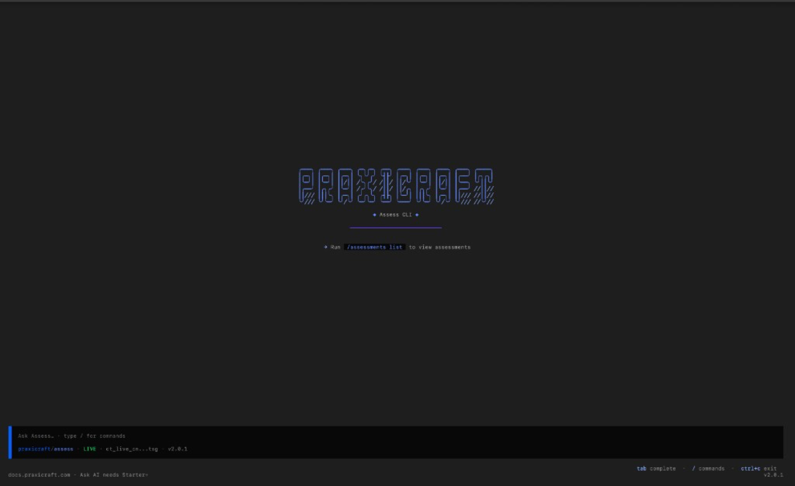

# Praxicraft Assess CLI

Official CLI for the [Assess Public API](https://docs.praxicraft.com) — interactive TUI (Ask AI + command palette) **and** non-interactive subcommands for scripts and CI.

Binary: `praxicraft-assess`  
Package: [`@praxicraft/assess-cli`](https://www.npmjs.com/package/@praxicraft/assess-cli)  
Repo: [praxicraft-platform/praxicraft-assess-cli](https://github.com/praxicraft-platform/praxicraft-assess-cli)



## Install

### npm (requires [Bun](https://bun.sh) ≥ 1.1 for the TUI)

```bash
npm install -g @praxicraft/assess-cli
# or
bun add -g @praxicraft/assess-cli
```

### Binary installer

```bash
curl -fsSL https://praxicraft.com/install.sh | sh && export PATH="$HOME/.local/bin:$PATH"
```

Installs the latest release binary (SHA-256 verified) as `praxicraft-assess` to `~/.local/bin` or `/usr/local/bin`. The `export` activates PATH in the **current** terminal (`curl | sh` cannot change your parent shell by itself).

```bash
PRAXICRAFT_VERSION=v2.0.2 curl -fsSL https://praxicraft.com/install.sh | sh
```

Or download `praxicraft-assess-{os}-{arch}` from [Releases](https://github.com/praxicraft-platform/praxicraft-assess-cli/releases).

### From source (Bun)

```bash
git clone https://github.com/praxicraft-platform/praxicraft-assess-cli.git
cd praxicraft-assess-cli
bun install
bun run src/index.ts
```

Requires [Bun](https://bun.sh) ≥ 1.1.

## Quickstart

```bash
# One-time: save a profile (interactive prompts)
praxicraft-assess configure

# Interactive TUI
praxicraft-assess

# Non-interactive (scripts / CI)
praxicraft-assess whoami
praxicraft-assess assessments list
```

Auth:

- Profile file: `~/.config/praxicraft/config.toml`
- Or env (preferred in CI): `PRAXICRAFT_API_KEY`, optional `PRAXICRAFT_API_BASE_URL`, `PRAXICRAFT_PROFILE`

## Non-interactive (scripts & CI)

Any subcommand runs **without** the TUI. JSON goes to stdout; errors to stderr with a non-zero exit code — safe for pipes and automation.

```bash
export PRAXICRAFT_API_KEY="ct_live_…"

praxicraft-assess whoami
praxicraft-assess org billing
praxicraft-assess assessments list
praxicraft-assess assessments get my-assessment
praxicraft-assess invites list
praxicraft-assess invites create my-assessment candidate@acme.com "Ada Lovelace"
praxicraft-assess results list my-assessment
praxicraft-assess cases list
praxicraft-assess pipelines list
praxicraft-assess webhooks list
praxicraft-assess interviews list
praxicraft-assess integrations list

praxicraft-assess version
praxicraft-assess help
```

Example in a pipeline:

```bash
#!/usr/bin/env bash
set -euo pipefail
export PRAXICRAFT_API_KEY="${PRAXICRAFT_API_KEY:?missing key}"

praxicraft-assess assessments list | jq '.data[] | .slug'
```

Notes:

- Passing **no args** (or `interactive`) opens the TUI.
- `configure` / `login` still use terminal prompts to save a profile; for headless auth, set `PRAXICRAFT_API_KEY` instead of calling `configure`.
- Standalone binaries from `install.sh` run these subcommands without Bun. The interactive TUI from the npm package needs Bun.

## Interactive UI

- **PRAXICRAFT** welcome + tip
- **Ask Assess…** — free text runs Ask AI (Starter+, `assistant:write`)
- **Type `/`** for the command palette (↑↓, ↵, esc)
- Status: `signed out` or `LIVE` / test mode · key hint · version

### Ask AI

Uses `POST /api/v1/public/assistant/chat/` plus MCP tools:

- Docs MCP: `https://docs.praxicraft.com/mcp` (HTTP; agent-only — answers link to real docs pages)
- Assess API tools: `@praxicraft/assess-mcp` (stdio / `npx`)

## Commands (TUI slash ↔ CLI)

| TUI | CLI equivalent |
|-----|----------------|
| `/login` | `praxicraft-assess configure` |
| `/logout` | `praxicraft-assess logout` |
| `/whoami` | `praxicraft-assess whoami` |
| `/org get\|billing\|stats` | `praxicraft-assess org …` |
| `/assessments list\|get` | `praxicraft-assess assessments …` |
| `/invites …` | `praxicraft-assess invites …` |
| `/results list` | `praxicraft-assess results list <slug>` |
| `/cases` … `/integrations` | `praxicraft-assess <resource> list` |
| free text / `/ai …` | (interactive only) |

## Contributing

See [CONTRIBUTING.md](./CONTRIBUTING.md) and [CODE_OF_CONDUCT.md](./CODE_OF_CONDUCT.md).

## License

MIT
